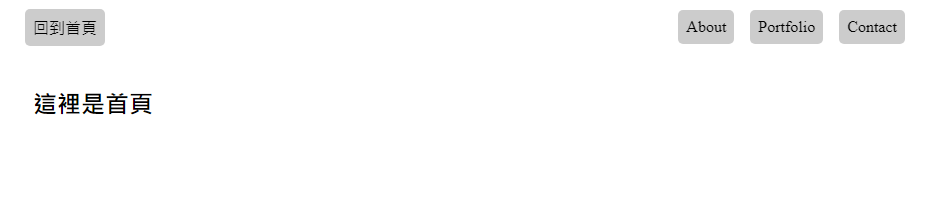

## 概述
一個由Express建立的簡易網站
## 功能
點擊導覽列的按鈕，可前往不同頁面
## 畫面截圖

 
## 安裝說明
1. 打開終端機，clone本專案
<pre><code>git clone https://github.com/Yuwen-ctw/AC2-3_examA22.git</code></pre>
2. 進入專案資料夾
<pre><code>cd AC2-3_examA22</code></pre>
3. 安裝npm套件
<pre><code>npm install</code></pre>
4. 啟動專案
<pre><code>npm run start</code></pre>
>or 開發者模式(需有 nodemon 套件)
<pre><code>npm run dev</code></pre>